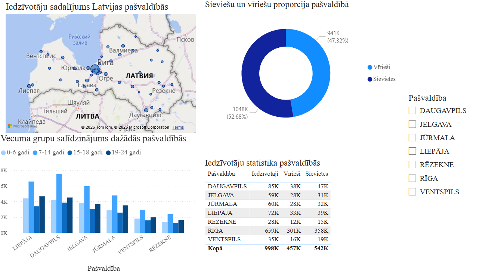
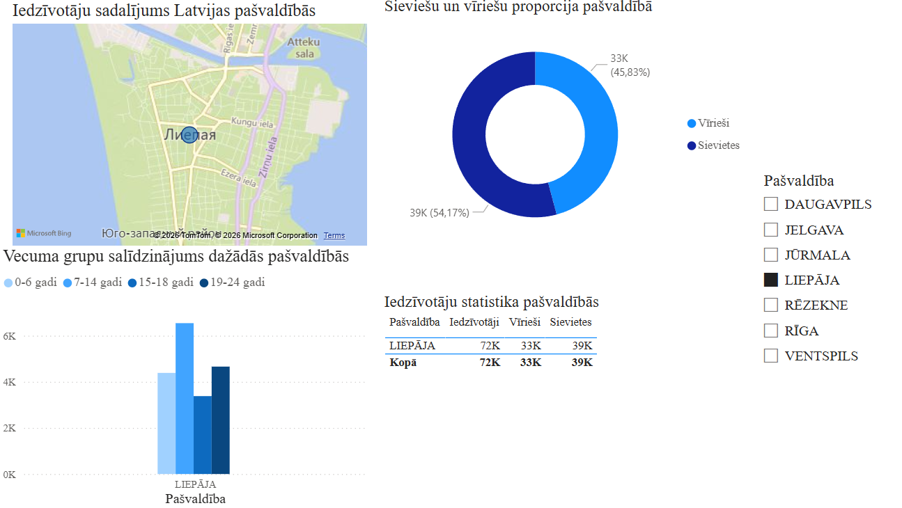

# Latvia Population Analysis Dashboard

## Overview
This project presents a Power BI dashboard based on Latvian population statistics data from 2026.

The dashboard analyzes:
- population distribution across municipalities,
- gender proportions,
- age group statistics,
- comparison between major Latvian cities.

## Tools Used
- Power BI Desktop
- CSV dataset
- Power Query

## Features
- Interactive slicer filtering
- Geographic map visualization
- Age group comparison charts
- Gender proportion donut chart
- Statistical data table

## Dataset Source
https://data.gov.lv/lv

## Dashboard Preview

## Interactive Filtering Example

## Notes
The detailed project report is written in Latvian because the project was completed as part of a university assignment in Latvia.
